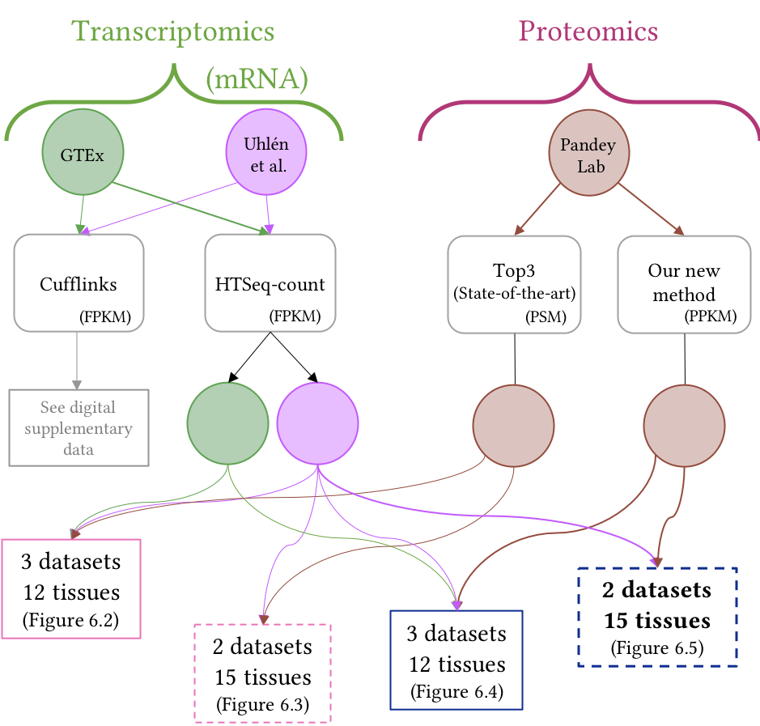

Analyses performed for:

# _Investigating Normal Human Gene Expression in Tissues with High-throughput Transcriptomic and Proteomic Data._ 
_____

Status of this repository: 
All the analyses for the thesis have been performed, but many still need to be ported to this repository.

The complete thesis latex code can be found at: [https://github.com/barzine/thesis](https://github.com/barzine/thesis).

The R functions can be found as a separate R package: [https://github.com/barzine/barzinePhdR](https://github.com/barzine/barzinePhdR) 

______

## Chapter 2: Available high-throughput normal human datasets
 - additional configuration files for the transcriptomic RNA-seq studies, except for GTEx:
[configuration files](chapter2/irap-configuration-files) used for [irap](https://github.com/nunofonseca/irap/releases/tag/v1.0.6b)
 - [perl scripts](chapter2/perl-scripts) were used on [E-MTAB-305](https://www.ebi.ac.uk/arrayexpress/experiments/E-MTAB-305/) to convert the fastq files to [Phred+33](https://en.wikipedia.org/wiki/FASTQ_format#Encoding). 

## Chapter 3: About expression, visualisation, correlation and clustering

## Chapter 4: Integrating gene expression data from normal tissues across RNA-seq studies

## Chapter 5: Human MS-based protein expression landscape

## Chapter 6: Integration of transcriptomic with proteomic data

There are many possible combinaisons based on the included datasets and their quantification methods.

