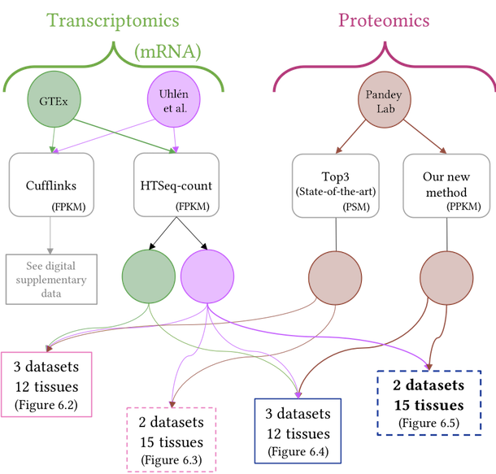

Analyses performed for:

# _Investigating Normal Human Gene Expression in Tissues with High-throughput Transcriptomic and Proteomic Data._ 
_____

[](https://www.repostatus.org/#active)
All the analyses for the thesis have been performed, but many still need to be ported to this repository.

The complete thesis xelatex code can be found at: [https://github.com/barzine/thesis](https://github.com/barzine/thesis).

The R functions can be found as a separate R package: [https://github.com/barzine/barzinePhdR](https://github.com/barzine/barzinePhdR) [](https://ci.appveyor.com/project/barzine/barzinePhdR)

Part of this site can be seen live at [barzine.net/~mitra/thesis/](http://barzine.net/~mitra/thesis).

Many of the analyses can be run "out-of-the-box". This repository has not been created to be used by anyone else but myself.
As such, there are several prerequisites that could be avoided if one gets into the code and tweaks away.
The most notable prerequisite that is not handled by the installation of [`barzinePhdR`](https://github.com/barzine/barzinePhdR) is the requirement of the [Linux Libertine](https://sourceforge.net/projects/linuxlibertine/) font. 

See [Install help](#install-help) for some pointers.
______

## Note
Due to the huge amount of files and loss of the primary server, the list of genes is not available directly at the moment. You can either email or rerun the scripts.
I am integrating everything into a shiny app, but this won't be done in the near future.

## Chapter 2: Available high-throughput normal human datasets
 - additional configuration files for the transcriptomic RNA-seq studies, except for GTEx:
[configuration files](chapter2/irap-configuration-files) used for [irap](https://github.com/nunofonseca/irap/releases/tag/v1.0.6b)
 - [perl scripts](chapter2/perl-scripts) were used on [E-MTAB-305](https://www.ebi.ac.uk/arrayexpress/experiments/E-MTAB-305/) to convert the fastq files to [Phred+33](https://en.wikipedia.org/wiki/FASTQ_format#Encoding). 


## Chapter 3: About expression, visualisation, correlation and clustering

## Chapter 4: Integrating gene expression data from normal tissues across RNA-seq studies

## Chapter 5: Human MS-based protein expression landscape

## Chapter 6: Integration of transcriptomic with proteomic data

There are many possible combinations based on the included datasets and their quantification methods.



# Install help

* [Linux Libertine](https://sourceforge.net/projects/linuxlibertine/) fonts
Note: to work with R, your font has to be distributed as TFF files.
Put the font files in ~/.fonts.
Please be careful to select only the plain regular, bold and italic. Otherwise, R will complain.

```{r installExtraFont}
    install.packages(c('extrafont','extrafontdb'))
```

```{r installFont}
    library(extrafont)
    font_import() #might take a bit of time
    loadfonts()
```
```{r checkInstalledFont}
    fonttable() #for more information
```

* [pandoc](https://pandoc.org/) can be probably bypassed. 
If you use Rstudio, it should come bundled with it. 

* [bioconductor](https://www.bioconductor.org/install/)
Most analyses won't require it, but `barzinePhdR` requires it.

```{r}
    install.packages(remotes)
    remotes::install_github(c('barzine/barzinePhdR','barzine/barzinePhdData')
```

